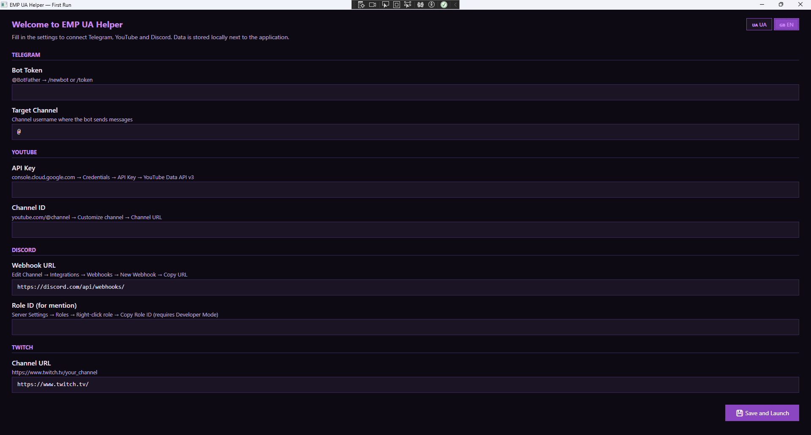
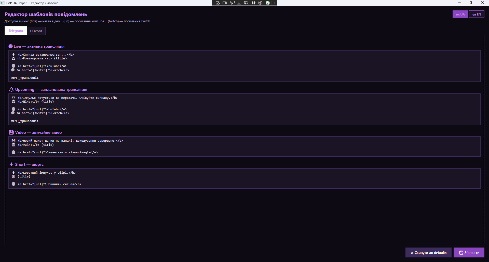

# EMP UA Helper

**UA:** Десктопний інструмент для одночасного надсилання сповіщень про трансляції та відео у Telegram і Discord одним кліком. Кожна платформа — джерело контенту (YouTube, Twitch) чи платформа сповіщень (Telegram, Discord) — вмикається і вимикається незалежно, будь-коли, без перезапуску програми.
**EN:** A desktop tool for sending simultaneous stream and video notifications to Telegram and Discord in one click. Every platform — a content source (YouTube, Twitch) or a notification platform (Telegram, Discord) — can be toggled independently, anytime, without restarting the app.

---

## ✨ Можливості / Features

- **UA:** Одночасна відправка в Telegram і Discord, з окремим прикладом повідомлення для кожної платформи перед відправкою / **EN:** Simultaneous Telegram and Discord notifications, with a separate message preview for each platform before sending
- **UA:** Автоматичне визначення типу контенту через YouTube: трансляція, анонс, відео, шортс / **EN:** Auto-detection of content type via YouTube: live stream, upcoming, video, short
- **UA:** Локальний кеш YouTube-контенту — заплановані трансляції не губляться, навіть якщо випадуть за межі останніх ~15 записів фіду каналу через активну публікацію іншого контенту / **EN:** Local YouTube content cache — scheduled streams aren't lost even if they fall outside the channel's last ~15 feed entries due to other active publishing
- **UA:** Кожна платформа опціональна — Telegram, YouTube, Discord, Twitch вмикаються/вимикаються незалежно (потрібна хоча б одна платформа сповіщень: Telegram або Discord) / **EN:** Every platform is optional — Telegram, YouTube, Discord, Twitch toggle independently (at least one notification platform, Telegram or Discord, is required)
- **UA:** Вікно "⚙️ Налаштування" в треї — зміна комбінації платформ у будь-який момент, без перезапуску програми / **EN:** "⚙️ Settings" window in the tray — change the platform combination anytime, without restarting the app
- **UA:** "📡 Надіслати сповіщення" — єдине вікно з живим прикладом перед відправкою: автопідбір останнього опублікованого контенту (за бажанням) або вибір конкретного відео зі списку з мініатюрою, назвою та реальною датою публікації/трансляції / **EN:** "📡 Send Notification" — a single window with a live preview before sending: auto-pick the latest published content (optional) or choose a specific video from a list with a thumbnail, title, and real publish/broadcast date
- **UA:** Різні шаблони повідомлень для кожного типу і платформи, з вбудованим редактором / **EN:** Separate message templates per content type and platform, with a built-in editor
- **UA:** Шаблони автоматично прибирають рядки з посиланнями, яких немає (наприклад, якщо Twitch вимкнено) — жодних битих посилань / **EN:** Templates automatically drop lines referencing links that aren't set (e.g. if Twitch is disabled) — no dangling links
- **UA:** М'яке попередження, якщо вставлене посилання не схоже на YouTube чи Twitch — не блокує відправку, лише підказка / **EN:** A soft warning if the pasted link doesn't look like YouTube or Twitch — doesn't block sending, just a hint
- **UA:** Discord embed з thumbnail, кольором і пінгом ролі / **EN:** Discord embed with thumbnail, color and role mention
- **UA:** Telegram HTML-форматування з превью посилання / **EN:** Telegram HTML formatting with link preview
- **UA:** Секретні поля (токени, API-ключі, webhook URL) приховані за замовчуванням з кнопкою перегляду 👁 / **EN:** Secret fields (tokens, API keys, webhook URL) are masked by default with a 👁 reveal button
- **UA:** Двомовний інтерфейс UA/EN у кожному вікні / **EN:** Bilingual UA/EN interface in every window
- **UA:** Живе в треї — не заважає робочому столу / **EN:** Lives in the system tray — stays out of your way
- **UA:** Логування помилок у файл / **EN:** Error logging to file

---

## 🚀 Початок роботи / Getting Started

### Вимоги / Requirements

**UA:** Windows 10/11 x64/x86. Self-contained версії (`win-x64`, `win-x86`) не потребують встановленого .NET. Версія `generic` потребує [.NET 10 Desktop Runtime](https://dotnet.microsoft.com/download/dotnet/10.0).
**EN:** Windows 10/11 x64/x86. Self-contained builds (`win-x64`, `win-x86`) require no .NET installation. The `generic` build requires [.NET 10 Desktop Runtime](https://dotnet.microsoft.com/download/dotnet/10.0).

### Встановлення / Installation

**UA:**
1. Завантажте останній реліз у розділі [Releases](../../releases/latest)
2. Розпакуйте в будь-яку папку
3. Запустіть `EMP.UAHelper.WPF.exe`
4. Оберіть потрібні вам платформи та заповніть поля першого запуску

**EN:**
1. Download the latest release from [Releases](../../releases/latest)
2. Extract to any folder
3. Run `EMP.UAHelper.WPF.exe`
4. Select the platforms you need and fill in the first-run setup fields

### Налаштування API / API Setup

Кожна секція має власний перемикач — заповнюй лише ті платформи, які реально використовуєш.
Each section has its own toggle — only fill in the platforms you actually use.

| Сервіс / Service | UA: Де отримати / EN: Where to get |
|---|---|
| Telegram Bot Token | [@BotFather](https://t.me/BotFather) → `/newbot` |
| YouTube API Key | [Google Cloud Console](https://console.cloud.google.com) → Credentials → API Key → YouTube Data API v3 |
| Discord Webhook URL | **UA:** Редагувати канал → Інтеграції → Вебхуки → Новий вебхук → Скопіювати URL   **EN:** Edit Channel → Integrations → Webhooks → New Webhook → Copy URL |
| Discord Role ID | **UA:** Налаштування сервера → Ролі → ПКМ на роль → Скопіювати ID ролі (потрібен режим розробника)   **EN:** Server Settings → Roles → Right-click role → Copy Role ID (requires Developer Mode) |

---

## ⚙️ Зміна платформ будь-коли / Changing Platforms Anytime

**UA:** Відкрий іконку в треї → "⚙️ Налаштування", щоб змінити комбінацію Telegram/YouTube/Discord/Twitch будь-якого дня — без видалення `appsettings.json` і без повторного проходження першого запуску. Зміни застосовуються одразу.
**EN:** Open the tray icon → "⚙️ Settings" to change the Telegram/YouTube/Discord/Twitch combination any day — without deleting `appsettings.json` and without going through First Run again. Changes apply immediately.

---

## 📡 Надіслати сповіщення / Send Notification

**UA:** Відкрий трей → "📡 Надіслати сповіщення". Це єдине вікно для будь-якого анонсу — з живим прикладом повідомлення для кожної увімкненої платформи (Telegram і Discord окремо), ще до відправки.

Якщо YouTube увімкнено, за замовчуванням активний автопідбір "Надсилати за останнім опублікованим контентом" (той самий пріоритет: активна трансляція → анонс → відео/шортс). Знявши цю галочку, можна натомість обрати конкретне відео зі списку — кожен пункт показує мініатюру, назву й реальну дату публікації або старту трансляції (не дату локального кешування), що зручно, коли кілька публікацій мають схожі назви чи превью того самого дня.

Список включає не лише останні ~15 записів з YouTube RSS-фіду (обмеження самого YouTube), а й раніше збережені заплановані трансляції — навіть ті, що вже випали з цього вікна через активну публікацію іншого контенту. Заплановані трансляції зберігаються локально в кеші без обмеження за часом, доки не настане їхня дата.

Поле "Заголовок" і тип (Live/Upcoming/Video/Short — категорія лише впливає на шаблон і колір, не привʼязана до платформи) підставляються в активні шаблони. Поле "Посилання" необов'язкове: якщо вказане — підставляється замість `{url}`; якщо порожнє — рядки шаблону з `{url}` просто не входять у повідомлення. Якщо вставлене посилання не схоже ні на YouTube, ні на Twitch — з'явиться м'яке попередження (не блокує відправку).

**EN:** Open the tray → "📡 Send Notification". This is the single window for any announcement — with a live message preview for each enabled platform (Telegram and Discord separately), before you send anything.

If YouTube is enabled, the "Send based on the latest published content" auto-pick is on by default (same priority: live stream → upcoming → video/short). Unchecking it lets you instead choose a specific video from a list — each entry shows a thumbnail, title, and the real publish or broadcast date (not the local caching date), which helps when several uploads share a similar title or thumbnail on the same day.

The list includes not just the last ~15 entries from the YouTube RSS feed (a YouTube limitation), but also previously cached scheduled streams — even ones that already fell out of that window due to other content being published. Scheduled streams are kept in the local cache with no time limit until their date arrives.

The "Title" field and type (Live/Upcoming/Video/Short — the category only affects the template and color, it's not tied to a platform) are inserted into the active templates. The "Link" field is optional: if provided, it replaces `{url}`; if left empty, template lines containing `{url}` are simply omitted. A soft warning appears if the pasted link doesn't look like YouTube or Twitch (it doesn't block sending).

---

## ✏️ Редактор шаблонів / Template Editor

**UA:** Відкрити через іконку в треї → "Редагувати шаблони". Підтримує змінні `{title}`, `{url}`, `{twitch}`, `{scheduled_telegram}` (дата/час для Telegram), `{scheduled_discord}` (Unix timestamp для Discord). Окремі шаблони для Telegram і Discord (заголовок embed + тіло) для кожного типу контенту.
**EN:** Open via tray icon → "Edit templates". Supports variables `{title}`, `{url}`, `{twitch}`, `{scheduled_telegram}` (date/time for Telegram), `{scheduled_discord}` (Unix timestamp for Discord). Separate templates for Telegram and Discord (embed title + body) per content type.

---

## 🛡️ Безпека / Security

**UA:** API-ключі вводяться через вікно першого запуску (або пізніше — через "⚙️ Налаштування") і зберігаються локально у `appsettings.json` поруч з програмою. Цей файл виключено з репозиторію через `.gitignore` і **ніколи не передається** на сторонні сервери. Секретні поля (Bot Token, API Key, Webhook URL) приховані зірочками за замовчуванням у обох вікнах — натисни 👁, щоб перевірити значення. Локальний кеш `content-cache.json` (назви ще неанонсованих запланованих трансляцій) так само зберігається лише на диску користувача й виключений з репозиторію.
**EN:** API keys are entered via the first-run window (or later via "⚙️ Settings") and stored locally in `appsettings.json` next to the executable. This file is excluded from the repository via `.gitignore` and is **never transmitted** to any third-party server. Secret fields (Bot Token, API Key, Webhook URL) are masked by default in both windows — press 👁 to reveal a value. The local `content-cache.json` cache (titles of not-yet-announced scheduled streams) is likewise kept only on the user's disk and excluded from the repository.

---

## 🧰 Бібліотеки / Third-party Libraries

- **[Telegram.Bot](https://github.com/TelegramBots/Telegram.Bot):** **UA:** Клієнт Telegram Bot API. **EN:** Telegram Bot API client.
- **[Google.Apis.YouTube.v3](https://developers.google.com/youtube/v3):** **UA:** YouTube Data API v3. **EN:** YouTube Data API v3.
- **[Microsoft.Extensions.Configuration](https://learn.microsoft.com/en-us/dotnet/core/extensions/configuration):** **UA:** Керування конфігурацією. **EN:** Configuration management.

---

## 📂 Структура репозиторію / Repository Structure

- `/EMP.UAHelper.Core` — **UA:** Логіка, сервіси, моделі. **EN:** Logic, services, models.
- `/EMP.UAHelper.WPF` — **UA:** WPF інтерфейс, трей. **EN:** WPF interface, tray.
- `appsettings.example.json` — **UA:** Шаблон налаштувань без реальних ключів. **EN:** Settings template without real keys.
- `.gitignore` — **UA:** Виключає конфіденційні файли (ключі, шаблони, кеш контенту, логи). **EN:** Excludes sensitive files (keys, templates, content cache, logs).
- `LICENSE` — **UA:** Ліцензія проєкту (GPL v3). **EN:** Project license (GPL v3).

---

## 📝 Історія версій / Changelog

**v1.2.1**
- **UA:** Виправлено: у вікні "📡 Надіслати сповіщення" мініатюра для Discord embed не підтягувалась, якщо відео було обране автопідбором чи зі списку кандидатів. Причина — Discord автоматично розгортає прев'ю лише для звичайного тексту з посиланням (як і Telegram), а наш Discord-сервіс відправляє структурований embed, де поле картинки завжди береться явно з даних відео, а не сканується з посилання. **EN:** Fixed: in the "📡 Send Notification" window, the Discord embed thumbnail wasn't populated when a video was chosen via auto-pick or from the candidate list. The cause — Discord only auto-unfurls a preview for plain text links (like Telegram does), while our Discord service sends a structured embed, where the image field is always taken explicitly from the video data rather than scanned from the link.

**v1.2.0**
- **UA:** Локальний кеш YouTube-контенту — заплановані трансляції не губляться, навіть якщо випадуть за межі останніх ~15 записів RSS-фіду через активну публікацію іншого контенту. **EN:** Local YouTube content cache — scheduled streams are no longer lost even if they fall outside the last ~15 RSS feed entries due to other active publishing.
- **UA:** "✍️ Ручне сповіщення" замінено на єдине вікно "📡 Надіслати сповіщення" — з живим прикладом повідомлення окремо для Telegram і Discord ще до відправки. **EN:** "✍️ Manual notification" replaced with a single "📡 Send Notification" window — with a live message preview for Telegram and Discord separately before sending.
- **UA:** Вибір конкретного відео зі списку кандидатів — з мініатюрою, назвою та реальною датою публікації/старту трансляції (замість дати локального кешування). **EN:** Picking a specific video from the candidate list — with a thumbnail, title, and the real publish/broadcast date (instead of the local caching date).
- **UA:** М'яке попередження для посилань, що не схожі на YouTube чи Twitch. **EN:** Soft warning for links that don't look like YouTube or Twitch.

**v1.1.0**
- **UA:** Telegram, YouTube, Discord, Twitch тепер повністю опціональні й незалежні — будь-яка комбінація (крім одночасного вимкнення Telegram і Discord) є валідною. **EN:** Telegram, YouTube, Discord, Twitch are now fully optional and independent — any combination (except disabling both Telegram and Discord) is valid.
- **UA:** Нове вікно "⚙️ Налаштування" — зміна комбінації платформ будь-коли, без перезапуску; вимкнення платформи лише призупиняє її використання й не стирає збережені ключі/токени в `appsettings.json`. **EN:** New "⚙️ Settings" window — change the platform combination anytime, without restarting; disabling a platform only pauses its use and doesn't wipe its saved keys/tokens in `appsettings.json`.
- **UA:** Секретні поля приховані за замовчуванням. **EN:** Secret fields are masked by default.

**v1.0.1 / v1.0.0**
- **UA:** Перший реліз — автовиявлення контенту YouTube, відправка в Telegram і Discord. **EN:** Initial release — YouTube content auto-detection, Telegram and Discord dispatch.

---

## 💜 Підтримка / Support the Project

**UA:** Якщо цей інструмент виявився корисним — підтримати можна тут:
**EN:** If you find this tool useful — support is appreciated:

- ☕ [Ko-fi](https://ko-fi.com/emp_ua) — **EN:** International
- 🏦 [Monobank](https://send.monobank.ua/jar/7PnVgizntU) — **UA:** Україна
- 💳 [StreamElements](https://streamelements.com/emp_ua/tip) — PayPal

---

## 📺 Автор / Author

**EMP_UA** — **UA:** Український контент-мейкер та локалізатор ігор. **EN:** Ukrainian content creator & game localizer.
[YouTube](https://www.youtube.com/@EMPs_UA) • [Twitch](https://www.twitch.tv/emp_ua) • [Discord](https://discord.gg/QdmgsCgPkp) • [Telegram](https://t.me/EMP_UA) • [Website](https://emp-ua-site.pages.dev)

---

*Licensed under [GNU General Public License v3.0](LICENSE)*