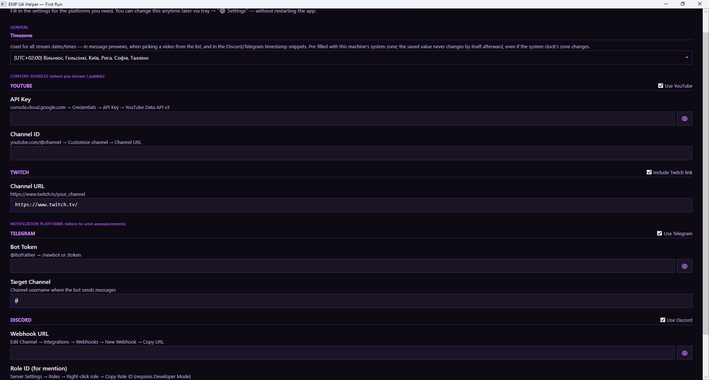
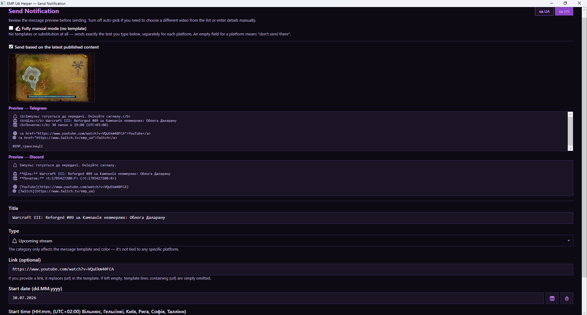
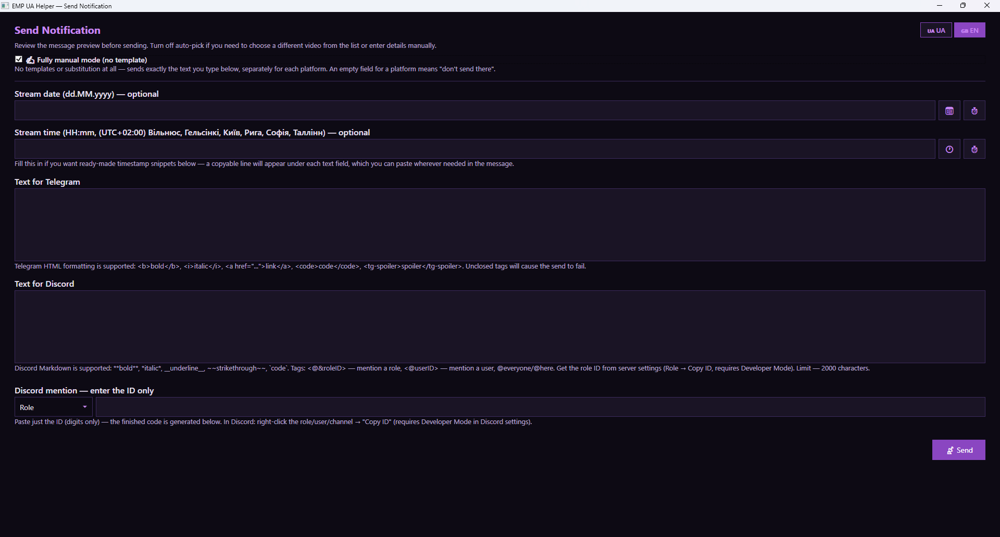
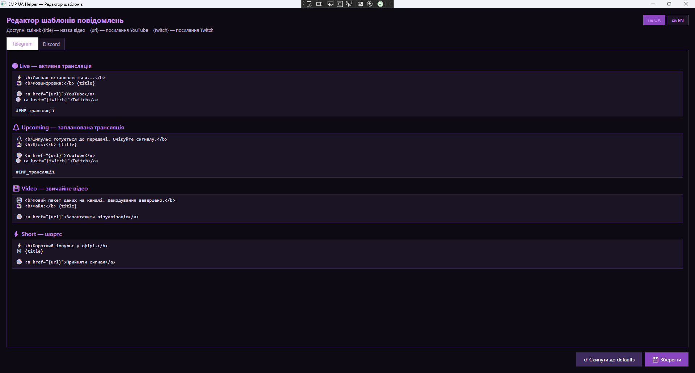

# EMP UA Helper

**UA:** Десктопний інструмент для одночасного надсилання сповіщень про трансляції та відео у Telegram і Discord одним кліком. Кожна платформа — джерело контенту (YouTube, Twitch) чи платформа сповіщень (Telegram, Discord) — вмикається і вимикається незалежно, будь-коли, без перезапуску програми.
**EN:** A desktop tool for sending simultaneous stream and video notifications to Telegram and Discord in one click. Every platform — a content source (YouTube, Twitch) or a notification platform (Telegram, Discord) — can be toggled independently, anytime, without restarting the app.

---

## ✨ Можливості / Features

- **UA:** Одночасна відправка в Telegram і Discord, з окремим прикладом повідомлення для кожної платформи перед відправкою / **EN:** Simultaneous Telegram and Discord notifications, with a separate message preview for each platform before sending
- **UA:** Автоматичне визначення типу контенту через YouTube: трансляція, анонс, відео, шортс / **EN:** Auto-detection of content type via YouTube: live stream, upcoming, video, short
- **UA:** Локальний кеш YouTube-контенту — заплановані трансляції не губляться, навіть якщо випадуть за межі останніх ~15 записів фіду каналу через активну публікацію іншого контенту / **EN:** Local YouTube content cache — scheduled streams aren't lost even if they fall outside the channel's last ~15 feed entries due to other active publishing
- **UA:** Кожна платформа опціональна — Telegram, YouTube, Discord, Twitch вмикаються/вимикаються незалежно (потрібна хоча б одна платформа сповіщень: Telegram або Discord) / **EN:** Every platform is optional — Telegram, YouTube, Discord, Twitch toggle independently (at least one notification platform, Telegram or Discord, is required)
- **UA:** Вікно "⚙️ Налаштування" в треї — зміна комбінації платформ у будь-який момент, без перезапуску програми / **EN:** "⚙️ Settings" window in the tray — change the platform combination anytime, without restarting the app
- **UA:** "📡 Надіслати сповіщення" — єдине вікно з живим прикладом перед відправкою: автопідбір останнього опублікованого контенту (за бажанням), вибір конкретного відео зі списку з мініатюрою, назвою та реальною датою публікації/трансляції, або повністю ручний режим без жодного шаблону / **EN:** "📡 Send Notification" — a single window with a live preview before sending: auto-pick the latest published content (optional), choose a specific video from a list with a thumbnail, title, and real publish/broadcast date, or a fully manual mode with no template at all
- **UA:** ✍️ Повністю ручний режим — окремі текстові поля для Telegram і Discord, без будь-якої підстановки шаблону: відправляється рівно те, що введено / **EN:** ✍️ Fully manual mode — separate text fields for Telegram and Discord, with zero template substitution: sends exactly what was typed
- **UA:** У ручному режимі — генератори готових до копіювання позначок часу (Telegram-рядок, Discord-тег) і згадок Discord (роль/користувач/канал за самим ID) / **EN:** In manual mode — generators for ready-to-copy timestamp snippets (Telegram string, Discord tag) and Discord mentions (role/user/channel by ID alone)
- **UA:** Часовий пояс налаштовується (не захардкоджений), коректно враховує перехід літній/зимовий час / **EN:** Configurable timezone (not hardcoded), correctly handles daylight saving transitions
- **UA:** Кнопки 📅🕐⏱ для всіх полів дати/часу — календар, вибір години/хвилини, підстановка поточного часу / **EN:** 📅🕐⏱ buttons for every date/time field — calendar, hour/minute picker, fill-in-current-time
- **UA:** Кілька іменованих каналів Discord з вибором, куди надіслати конкретне сповіщення / **EN:** Multiple named Discord channels with a picker for where a specific notification goes
- **UA:** Різні шаблони повідомлень для кожного типу і платформи, з вбудованим редактором / **EN:** Separate message templates per content type and platform, with a built-in editor
- **UA:** Шаблони автоматично прибирають рядки з посиланнями, яких немає (наприклад, якщо Twitch вимкнено) — жодних битих посилань / **EN:** Templates automatically drop lines referencing links that aren't set (e.g. if Twitch is disabled) — no dangling links
- **UA:** М'яке попередження, якщо вставлене посилання не схоже на YouTube чи Twitch — не блокує відправку, лише підказка / **EN:** A soft warning if the pasted link doesn't look like YouTube or Twitch — doesn't block sending, just a hint
- **UA:** Discord embed з thumbnail, кольором і пінгом ролі / **EN:** Discord embed with thumbnail, color and role mention
- **UA:** Telegram HTML-форматування з превью посилання / **EN:** Telegram HTML formatting with link preview
- **UA:** Секретні поля (токени, API-ключі, webhook URL) приховані за замовчуванням з кнопкою перегляду 👁 / **EN:** Secret fields (tokens, API keys, webhook URL) are masked by default with a 👁 reveal button
- **UA:** Двомовний інтерфейс UA/EN у кожному вікні / **EN:** Bilingual UA/EN interface in every window
- **UA:** Живе в треї — не заважає робочому столу / **EN:** Lives in the system tray — stays out of your way
- **UA:** Логування помилок у файл / **EN:** Error logging to file

---

## 🚀 Початок роботи / Getting Started

### Вимоги / Requirements

**UA:** Windows 10/11 x64/x86. Self-contained версії (`win-x64`, `win-x86`) не потребують встановленого .NET. Версія `generic` потребує [.NET 10 Desktop Runtime](https://dotnet.microsoft.com/download/dotnet/10.0).
**EN:** Windows 10/11 x64/x86. Self-contained builds (`win-x64`, `win-x86`) require no .NET installation. The `generic` build requires [.NET 10 Desktop Runtime](https://dotnet.microsoft.com/download/dotnet/10.0).

### Встановлення / Installation

**UA:**
1. Завантажте останній реліз у розділі [Releases](../../releases/latest)
2. Розпакуйте в будь-яку папку
3. Запустіть `EMP.UAHelper.WPF.exe`
4. Оберіть потрібні вам платформи та заповніть поля першого запуску

**EN:**
1. Download the latest release from [Releases](../../releases/latest)
2. Extract to any folder
3. Run `EMP.UAHelper.WPF.exe`
4. Select the platforms you need and fill in the first-run setup fields

### Налаштування API / API Setup

Кожна секція має власний перемикач — заповнюй лише ті платформи, які реально використовуєш.
Each section has its own toggle — only fill in the platforms you actually use.

| Сервіс / Service | UA: Де отримати / EN: Where to get |
|---|---|
| Telegram Bot Token | [@BotFather](https://t.me/BotFather) → `/newbot` |
| YouTube API Key | [Google Cloud Console](https://console.cloud.google.com) → Credentials → API Key → YouTube Data API v3 |
| Discord Webhook URL | **UA:** Редагувати канал → Інтеграції → Вебхуки → Новий вебхук → Скопіювати URL   **EN:** Edit Channel → Integrations → Webhooks → New Webhook → Copy URL |
| Discord Role ID | **UA:** Налаштування сервера → Ролі → ПКМ на роль → Скопіювати ID ролі (потрібен режим розробника)   **EN:** Server Settings → Roles → Right-click role → Copy Role ID (requires Developer Mode) |

**UA:** Той самий Discord Webhook URL вище — це основний канал. У "⚙️ Налаштування" в секції Discord є ще два необов'язкові поля: назва основного каналу (підпис для списку вибору у вікні надсилання, за замовчуванням "Основний канал") і "Додаткові канали Discord" — кнопкою ➕ додаєш будь-яку кількість пар назва+вебхук для інших каналів (наприклад, тестового чи іншомовного). З двома й більше каналами у вікні "📡 Надіслати сповіщення" з'являється можливість обрати, куди саме йде конкретне сповіщення (докладніше — нижче).
**EN:** The Discord Webhook URL above is the primary channel. Under "⚙️ Settings" in the Discord section there are two more optional fields: a primary channel name (a label for the picker in the send window, defaults to "Primary channel") and "Additional Discord channels" — the ➕ button lets you add any number of name+webhook pairs for other channels (e.g. a test channel or a different-language one). With two or more channels configured, the "📡 Send Notification" window gains the option to pick where a specific notification goes (more on this below).

---

## ⚙️ Зміна платформ будь-коли / Changing Platforms Anytime

**UA:** Відкрий іконку в треї → "⚙️ Налаштування", щоб змінити комбінацію Telegram/YouTube/Discord/Twitch будь-якого дня — без видалення `appsettings.json` і без повторного проходження першого запуску. Зміни застосовуються одразу.
**EN:** Open the tray icon → "⚙️ Settings" to change the Telegram/YouTube/Discord/Twitch combination any day — without deleting `appsettings.json` and without going through First Run again. Changes apply immediately.

---

## 🕒 Часовий пояс / Timezone

**UA:** І вікно першого запуску, і "⚙️ Налаштування" мають поле "Часовий пояс" — воно визначає, як інтерпретується дата/час у прикладах повідомлень, у списку кандидатів з YouTube і в позначках часу для Discord/Telegram (у ручному режимі). При першому запуску поле автоматично підставляється системною зоною цього комп'ютера — нічого обирати не обов'язково. Значення зберігається явно в `appsettings.json` і більше не змінюється саме собою, навіть якщо системний час комп'ютера пізніше переналаштують (відрядження, VPN тощо) — це свідоме рішення, щоб уже заплановані анонси не "поплили". Літній/зимовий перехід усередині обраної зони обробляється коректно й автоматично. Старі інсталяції без цього поля в `appsettings.json` і далі працюють як раніше — за київським часом.
**EN:** Both the first-run window and "⚙️ Settings" have a "Timezone" field — it determines how the date/time is interpreted in message previews, in the YouTube candidate list, and in the Discord/Telegram timestamp snippets (manual mode). On first run, the field is auto-filled with this machine's system zone — nothing has to be picked manually. The value is saved explicitly into `appsettings.json` and never changes by itself afterward, even if the machine's system clock zone changes later (travel, VPN, etc.) — that's intentional, so already-scheduled announcements don't drift. Daylight saving transitions within the chosen zone are handled correctly and automatically. Existing installs without this field in `appsettings.json` keep working as before — on Kyiv time.

---

## 📡 Надіслати сповіщення / Send Notification

**UA:** Відкрий трей → "📡 Надіслати сповіщення". Це єдине вікно для будь-якого анонсу — з живим прикладом повідомлення для кожної увімкненої платформи (Telegram і Discord окремо), ще до відправки.

Якщо YouTube увімкнено, за замовчуванням активний автопідбір "Надсилати за останнім опублікованим контентом" (той самий пріоритет: активна трансляція → анонс → відео/шортс). Знявши цю галочку, можна натомість обрати конкретне відео зі списку — кожен пункт показує мініатюру, назву й реальну дату публікації або старту трансляції (не дату локального кешування), що зручно, коли кілька публікацій мають схожі назви чи превью того самого дня.

Список включає не лише останні ~15 записів з YouTube RSS-фіду (обмеження самого YouTube), а й раніше збережені заплановані трансляції — навіть ті, що вже випали з цього вікна через активну публікацію іншого контенту. Заплановані трансляції зберігаються локально в кеші без обмеження за часом, доки не настане їхня дата.

Поле "Заголовок" і тип (Live/Upcoming/Video/Short — категорія лише впливає на шаблон і колір, не привʼязана до платформи) підставляються в активні шаблони. Поле "Посилання" необов'язкове: якщо вказане — підставляється замість `{url}`; якщо порожнє — рядки шаблону з `{url}` просто не входять у повідомлення. Якщо вставлене посилання не схоже ні на YouTube, ні на Twitch — з'явиться м'яке попередження (не блокує відправку).

Поля дати й часу початку трансляції (для типу Upcoming) мають кнопки 📅 (відкрити календар), 🕐 (обрати годину/хвилину) і ⏱ (підставити поточні дату/час у зоні з "⚙️ Налаштування") — набирати вручну більше не обов'язково, хоча й досі можна.

**EN:** Open the tray → "📡 Send Notification". This is the single window for any announcement — with a live message preview for each enabled platform (Telegram and Discord separately), before you send anything.

If YouTube is enabled, the "Send based on the latest published content" auto-pick is on by default (same priority: live stream → upcoming → video/short). Unchecking it lets you instead choose a specific video from a list — each entry shows a thumbnail, title, and the real publish or broadcast date (not the local caching date), which helps when several uploads share a similar title or thumbnail on the same day.

The list includes not just the last ~15 entries from the YouTube RSS feed (a YouTube limitation), but also previously cached scheduled streams — even ones that already fell out of that window due to other content being published. Scheduled streams are kept in the local cache with no time limit until their date arrives.

The "Title" field and type (Live/Upcoming/Video/Short — the category only affects the template and color, it's not tied to a platform) are inserted into the active templates. The "Link" field is optional: if provided, it replaces `{url}`; if left empty, template lines containing `{url}` are simply omitted. A soft warning appears if the pasted link doesn't look like YouTube or Twitch (it doesn't block sending).

The stream start date/time fields (for the Upcoming type) have 📅 (open a calendar), 🕐 (pick hour/minute) and ⏱ (fill in the current date/time in the zone set under "⚙️ Settings") buttons — manual typing is no longer required, though still fully supported.

---

**UA:** Скріншот вище показує типовий (шаблонний) режим. Галочка "✍️ Повністю ручний режим (без шаблону)" перемикає вікно в інший режим, без жодної підстановки: замість заголовка/типу/посилання/дати з'являються два окремі текстові поля — для Telegram і для Discord. Відправляється рівно те, що введено; порожнє поле означає "не надсилати на цю платформу". Поля розділені навмисно, бо в кожної платформи свій синтаксис: Telegram підтримує HTML-теги (`<b>`, `<i>`, `<a href>`, `<code>`, `<tg-spoiler>` тощо — розпізнаються, якщо вписати їх вручну), а Discord — власний Markdown (`**жирний**`, `*курсив*`, `` `код` ``) і теги згадувань (`<@&ID_ролі>` для ролі, `<@ID_користувача>` для користувача, `@everyone`/`@here`) прямо в тексті, без додаткового екранування.

У цьому ж режимі є необов'язкові поля "Дата трансляції" і "Час трансляції" (у часовому поясі з "⚙️ Налаштування", за замовчуванням — системна зона цього комп'ютера) — спільні для обох платформ. Якщо їх заповнити, під кожним текстовим полем з'являється готова позначка часу: для Telegram — читабельний рядок на кшталт "29 липня о 19:00 (UTC+3)", для Discord — тег `<t:...:F> (<t:...:R>)`, який Discord сам відображає в локальному часі кожного читача. Позначки лише генеруються (для копіювання кнопкою 📋 або виділенням) — нікуди автоматично не вставляються, бо це суперечило б суті ручного режиму.

**EN:** The screenshot above shows the default (template) mode. The "✍️ Fully manual mode (no template)" checkbox switches the window into a different mode, with zero substitution: instead of title/type/link/date, two separate text fields appear — one for Telegram, one for Discord. Whatever is typed is sent exactly as-is; an empty field means "don't send to that platform." The fields are kept separate on purpose, since each platform has its own syntax: Telegram supports HTML tags (`<b>`, `<i>`, `<a href>`, `<code>`, `<tg-spoiler>`, etc. — recognized if typed by hand), while Discord uses its own Markdown (`**bold**`, `*italic*`, `` `code` ``) and mention tags (`<@&roleID>` for a role, `<@userID>` for a user, `@everyone`/`@here`) directly in the text, no extra escaping needed.

The same mode has optional "Stream date" and "Stream time" fields (in the timezone set under "⚙️ Settings", defaulting to this machine's system zone) — shared by both platforms. Filling them in reveals a ready-made timestamp snippet under each text field: for Telegram, a readable string like "29 July at 19:00 (UTC+3)"; for Discord, a `<t:...:F> (<t:...:R>)` tag that Discord renders in each reader's own local time. Snippets are only generated (copyable via the 📋 button or by selecting the text) — nothing is auto-inserted, since that would defeat the purpose of manual mode.

**UA:** За тим самим принципом працює поле "Згадка Discord" — вводиться лише ID (самі цифри), а готовий код генерується нижче з кнопкою копіювання. Тип обирається списком, бо синтаксис у Discord різний і переплутати легко: роль — `<@&ID>`, користувач — `<@ID>`, канал — `<#ID>`. ID беруться в Discord через ПКМ по ролі/користувачу/каналу → "Копіювати ID" (потрібен режим розробника в налаштуваннях Discord). Якщо замість ID вставити цілий скопійований тег, поле його відхилить — інакше вийшов би вкладений сам у себе тег, який Discord показав би як звичайний текст.

**EN:** The "Discord mention" field works on the same principle — you enter just the ID (digits only) and the finished code is generated below with a copy button. The type is picked from a list because Discord's syntax differs and is easy to mix up: role — `<@&ID>`, user — `<@ID>`, channel — `<#ID>`. IDs come from Discord via right-click on the role/user/channel → "Copy ID" (requires Developer Mode in Discord settings). Pasting a whole copied tag instead of an ID is rejected — otherwise you'd get a self-nested tag that Discord would render as plain text.

**UA:** Якщо в "⚙️ Налаштування" заведено більше одного каналу Discord, у вікні з'являється галочка "Надіслати в інший канал Discord" зі списком. Типово повідомлення завжди йде в основний канал — галочка існує саме для того, щоб зміна каналу була свідомою дією, а не випадковим кліком у списку. При одному налаштованому каналі блок не показується взагалі. Автоматичні сповіщення завжди йдуть в основний канал незалежно від цього вибору.

**EN:** If more than one Discord channel is configured under "⚙️ Settings", a "Send to a different Discord channel" checkbox with a list appears in the window. By default the message always goes to the primary channel — the checkbox exists precisely so that changing the channel is a deliberate act rather than a stray click in a list. With a single configured channel the block isn't shown at all. Automatic notifications always go to the primary channel regardless of this selection.

> [!WARNING]
> **UA:** Дві функції, додані у v1.3.0, наразі **не протестовані в реальних умовах**:
> - **надсилання в альтернативний канал Discord** — код написаний і перевірений статично, але жодного реального надсилання в другий канал ще не робилось;
> - **запасний шлях через YouTube Data API** при збої RSS-фіду — реалізований і звірений з метаданими SDK, але спрацював він лише в теорії: на момент написання RSS-фід відновився сам, тому шлях не проходив живої перевірки. Зокрема не підтверджено емпірично, що `search.list` з `eventType=upcoming` справді повертає всі заплановані трансляції каналу.
>
> Використовуйте їх з розумінням, що поведінка може відрізнятись від описаної. Про будь-яку розбіжність буде корисно повідомити в [Issues](https://github.com/EMP-UA/EMP-UA-Helper/issues).
>
> **EN:** Two features added in v1.3.0 are currently **untested in real conditions**:
> - **sending to an alternative Discord channel** — the code is written and statically verified, but no actual send to a second channel has been performed yet;
> - **the YouTube Data API fallback** for when the RSS feed fails — implemented and cross-checked against the SDK metadata, but it has only worked in theory: by the time of writing the RSS feed had recovered on its own, so the path never got a live run. In particular it hasn't been empirically confirmed that `search.list` with `eventType=upcoming` really returns all of a channel's scheduled streams.
>
> Use them with the understanding that behavior may differ from what's described. Reporting any discrepancy in [Issues](https://github.com/EMP-UA/EMP-UA-Helper/issues) would be helpful.

---

## ✏️ Редактор шаблонів / Template Editor

**UA:** Відкрити через іконку в треї → "Редагувати шаблони". Підтримує змінні `{title}`, `{url}`, `{twitch}`, `{scheduled_telegram}` (дата/час для Telegram), `{scheduled_discord}` (Unix timestamp для Discord). Окремі шаблони для Telegram і Discord (заголовок embed + тіло) для кожного типу контенту.
**EN:** Open via tray icon → "Edit templates". Supports variables `{title}`, `{url}`, `{twitch}`, `{scheduled_telegram}` (date/time for Telegram), `{scheduled_discord}` (Unix timestamp for Discord). Separate templates for Telegram and Discord (embed title + body) per content type.

---

## 🛡️ Безпека / Security

**UA:** API-ключі вводяться через вікно першого запуску (або пізніше — через "⚙️ Налаштування") і зберігаються локально у `appsettings.json` поруч з програмою. Цей файл виключено з репозиторію через `.gitignore` і **ніколи не передається** на сторонні сервери. Секретні поля (Bot Token, API Key, Webhook URL) приховані зірочками за замовчуванням у обох вікнах — натисни 👁, щоб перевірити значення. Локальний кеш `content-cache.json` (назви ще неанонсованих запланованих трансляцій) так само зберігається лише на диску користувача й виключений з репозиторію.
**EN:** API keys are entered via the first-run window (or later via "⚙️ Settings") and stored locally in `appsettings.json` next to the executable. This file is excluded from the repository via `.gitignore` and is **never transmitted** to any third-party server. Secret fields (Bot Token, API Key, Webhook URL) are masked by default in both windows — press 👁 to reveal a value. The local `content-cache.json` cache (titles of not-yet-announced scheduled streams) is likewise kept only on the user's disk and excluded from the repository.

---

## 🧰 Бібліотеки / Third-party Libraries

- **[Telegram.Bot](https://github.com/TelegramBots/Telegram.Bot):** **UA:** Клієнт Telegram Bot API. **EN:** Telegram Bot API client.
- **[Google.Apis.YouTube.v3](https://developers.google.com/youtube/v3):** **UA:** YouTube Data API v3. **EN:** YouTube Data API v3.
- **[Microsoft.Extensions.Configuration](https://learn.microsoft.com/en-us/dotnet/core/extensions/configuration):** **UA:** Керування конфігурацією. **EN:** Configuration management.

---

## 📂 Структура репозиторію / Repository Structure

- `/EMP.UAHelper.Core` — **UA:** Логіка, сервіси, моделі. **EN:** Logic, services, models.
- `/EMP.UAHelper.WPF` — **UA:** WPF інтерфейс, трей. **EN:** WPF interface, tray.
- `appsettings.example.json` — **UA:** Шаблон налаштувань без реальних ключів. **EN:** Settings template without real keys.
- `.gitignore` — **UA:** Виключає конфіденційні файли (ключі, шаблони, кеш контенту, логи). **EN:** Excludes sensitive files (keys, templates, content cache, logs).
- `LICENSE` — **UA:** Ліцензія проєкту (GPL v3). **EN:** Project license (GPL v3).

---

## 📝 Історія версій / Changelog

**v1.3.0**
- **UA:** Повернуто повністю ручний режим — перемикач "✍️ Повністю ручний режим (без шаблону)" у вікні "📡 Надіслати сповіщення". Вимикає будь-яку підстановку шаблону: окремі текстові поля для Telegram (HTML-форматування) і Discord (Markdown, теги ролей/користувачів) — відправляється рівно те, що введено. **EN:** Brought back fully manual mode — a "✍️ Fully manual mode (no template)" toggle in the "📡 Send Notification" window. Disables all template substitution: separate text fields for Telegram (HTML formatting) and Discord (Markdown, role/user mention tags) — sends exactly what was typed.
- **UA:** У ручному режимі додано необов'язкові поля дати/часу, що генерують готові до копіювання позначки часу — читабельний рядок для Telegram і `<t:...:F>` тег для Discord (той самий формат, що й в автоматичних Upcoming-шаблонах). **EN:** Manual mode now has optional date/time fields that generate ready-to-copy timestamp snippets — a readable string for Telegram and a `<t:...:F>` tag for Discord (the same format used in the automatic Upcoming templates).
- **UA:** У ручному режимі додано генератор згадок Discord: вводиться лише ID, а готовий код (`<@&ID>` для ролі, `<@ID>` для користувача, `<#ID>` для каналу) генерується нижче з кнопкою копіювання — за тим самим принципом, що й позначки часу. Набирати кутові дужки й `&` вручну більше не потрібно. Введений замість ID цілий скопійований тег відхиляється (ID у Discord — це лише цифри), щоб у повідомлення не потрапив вкладений сам у себе тег. **EN:** Manual mode now has a Discord mention generator: you enter just the ID and the finished code (`<@&ID>` for a role, `<@ID>` for a user, `<#ID>` for a channel) is generated below with a copy button — the same principle as the timestamps. No more typing angle brackets and `&` by hand. A whole copied tag pasted instead of an ID is rejected (a Discord ID is digits only), so no self-nested tag ends up in the message.
- **UA:** Додано підтримку кількох іменованих каналів Discord. Назви задає користувач, кількість довільна — нічого не захардкоджено. У вікні надсилання типово використовується основний канал; галочка «Надіслати в інший канал Discord» відкриває список, і сам блок з'являється лише якщо каналів справді більше одного. Автоматичні сповіщення завжди йдуть в основний канал. **EN:** Added support for multiple named Discord channels. The names are set by the user and the count is arbitrary — nothing is hardcoded. The send window uses the primary channel by default; a "Send to a different Discord channel" checkbox reveals the list, and the block itself appears only when there really is more than one channel. Automatic notifications always go to the primary channel.
- **UA:** Часовий пояс для всіх дат трансляції більше не захардкоджений на Київ у трьох місцях коду — тепер це поле налаштувань (`TimeZoneId`), яке при першому запуску автоматично підставляється з системної зони, а існуючі інсталяції без цього поля й далі коректно працюють за Києвом (зворотна сумісність). **EN:** The timezone used for all stream dates is no longer hardcoded to Kyiv in three places in the code — it's now a settings field (`TimeZoneId`) that's auto-filled from the system's zone on first run, while existing installs without this field keep working correctly on Kyiv time (backward compatible).
- **UA:** Усі 4 поля дати/часу (шаблонний і ручний режими) отримали кнопку 📅 (календар), 🕐 (вибір години/хвилини) і ⏱ (підставити поточні дату/час у налаштованому часовому поясі) — набирати вручну більше не обов'язково, хоча й досі можна. **EN:** All 4 date/time fields (template and manual modes) got a 📅 (calendar), 🕐 (hour/minute picker), and ⏱ (fill in the current date/time in the configured timezone) button — manual typing is no longer required, though still fully supported.
- **UA:** Додано опціональний запасний шлях через YouTube Data API на випадок, коли RSS-фід лежить тривало. Кнопка 🔑 з'являється **тільки** в банері помилки (у нормальному стані її немає) і перед запуском питає підтвердження з явною ціною: ~202 одиниці добової квоти проти 0 у безкоштовного RSS. Шлях складається з трьох запитів — плейлист завантажень (звичайні відео та Shorts), `search.list eventType=upcoming` (заплановані трансляції) і `eventType=live` (активна), бо самого плейлиста завантажень для запланованих трансляцій недостатньо. **EN:** Added an optional YouTube Data API fallback for when the RSS feed is down for a longer stretch. The 🔑 button appears **only** in the error banner (it doesn't exist in the normal state) and asks for confirmation with an explicit price before running: ~202 daily quota units versus 0 for the free RSS feed. The path is three requests — the uploads playlist (regular videos and Shorts), `search.list eventType=upcoming` (scheduled streams) and `eventType=live` (the active one), because the uploads playlist alone isn't enough for scheduled streams.
- **UA:** ⚠️ Не протестовано в реальних умовах: надсилання в альтернативний канал Discord і щойно описаний запасний шлях через YouTube Data API. Обидва реалізовані й перевірені статично, але живого проходу не мали. **EN:** ⚠️ Untested in real conditions: sending to an alternative Discord channel and the YouTube Data API fallback described above. Both are implemented and statically verified, but never had a live run.
- **UA:** Запит до RSS-фіду YouTube тепер повторюється до 3 разів зі зростаючою паузою, якщо фід віддає 5xx або 429 (сервіс періодично робить це на цілком валідний ChannelId). Помилки на кшталт 404 не повторюються — вони означають неправильний ChannelId, і повтори його не виправлять. Додано явний User-Agent і спільний HttpClient замість створення нового на кожен запит. **EN:** The YouTube RSS feed request is now retried up to 3 times with growing back-off when the feed answers 5xx or 429 (the service does this intermittently even for a perfectly valid ChannelId). Errors like 404 are not retried — they mean a wrong ChannelId, which retries won't fix. Added an explicit User-Agent and a shared HttpClient instead of creating a new one per request.
- **UA:** Виправлено: збій мережі або вичерпана квота YouTube Data API більше не спустошують вікно надсилання. Раніше виняток відкидав і локальний кеш, а повідомлення про помилку було приховане разом зі згорнутою панеллю вибору — вікно виглядало просто порожнім без пояснень, і причина нікуди не логувалась. Тепер список показується з локального кешу, у вікні з'являється помітний банер з кнопкою ↻ (повторити без перезапуску), повний стектрейс пишеться в `logs/`, а модальне вікно з'являється лише коли кеш теж порожній — тобто працювати справді нічим. **EN:** Fixed: a network failure or an exhausted YouTube Data API quota no longer empties the send window. Previously the exception discarded the local cache too, and the error message was hidden along with the collapsed picker panel — the window just looked blank with no explanation, and the cause was never logged. Now the list is served from the local cache, a clearly visible banner with a ↻ (retry without restarting) button appears, the full stack trace goes to `logs/`, and a modal dialog is shown only when the cache is empty as well — i.e. when there is genuinely nothing to work with.

**v1.2.1**
- **UA:** Виправлено: у вікні "📡 Надіслати сповіщення" мініатюра для Discord embed не підтягувалась, якщо відео було обране автопідбором чи зі списку кандидатів. Причина — Discord автоматично розгортає прев'ю лише для звичайного тексту з посиланням (як і Telegram), а наш Discord-сервіс відправляє структурований embed, де поле картинки завжди береться явно з даних відео, а не сканується з посилання. **EN:** Fixed: in the "📡 Send Notification" window, the Discord embed thumbnail wasn't populated when a video was chosen via auto-pick or from the candidate list. The cause — Discord only auto-unfurls a preview for plain text links (like Telegram does), while our Discord service sends a structured embed, where the image field is always taken explicitly from the video data rather than scanned from the link.

**v1.2.0**
- **UA:** Локальний кеш YouTube-контенту — заплановані трансляції не губляться, навіть якщо випадуть за межі останніх ~15 записів RSS-фіду через активну публікацію іншого контенту. **EN:** Local YouTube content cache — scheduled streams are no longer lost even if they fall outside the last ~15 RSS feed entries due to other active publishing.
- **UA:** "✍️ Ручне сповіщення" замінено на єдине вікно "📡 Надіслати сповіщення" — з живим прикладом повідомлення окремо для Telegram і Discord ще до відправки. **EN:** "✍️ Manual notification" replaced with a single "📡 Send Notification" window — with a live message preview for Telegram and Discord separately before sending.
- **UA:** Вибір конкретного відео зі списку кандидатів — з мініатюрою, назвою та реальною датою публікації/старту трансляції (замість дати локального кешування). **EN:** Picking a specific video from the candidate list — with a thumbnail, title, and the real publish/broadcast date (instead of the local caching date).
- **UA:** М'яке попередження для посилань, що не схожі на YouTube чи Twitch. **EN:** Soft warning for links that don't look like YouTube or Twitch.

**v1.1.0**
- **UA:** Telegram, YouTube, Discord, Twitch тепер повністю опціональні й незалежні — будь-яка комбінація (крім одночасного вимкнення Telegram і Discord) є валідною. **EN:** Telegram, YouTube, Discord, Twitch are now fully optional and independent — any combination (except disabling both Telegram and Discord) is valid.
- **UA:** Нове вікно "⚙️ Налаштування" — зміна комбінації платформ будь-коли, без перезапуску; вимкнення платформи лише призупиняє її використання й не стирає збережені ключі/токени в `appsettings.json`. **EN:** New "⚙️ Settings" window — change the platform combination anytime, without restarting; disabling a platform only pauses its use and doesn't wipe its saved keys/tokens in `appsettings.json`.
- **UA:** Секретні поля приховані за замовчуванням. **EN:** Secret fields are masked by default.

**v1.0.1 / v1.0.0**
- **UA:** Перший реліз — автовиявлення контенту YouTube, відправка в Telegram і Discord. **EN:** Initial release — YouTube content auto-detection, Telegram and Discord dispatch.

---

## 💜 Підтримка / Support the Project

**UA:** Якщо цей інструмент виявився корисним — підтримати можна тут:
**EN:** If you find this tool useful — support is appreciated:

- ☕ [Ko-fi](https://ko-fi.com/emp_ua) — **EN:** International
- 🏦 [Monobank](https://send.monobank.ua/jar/7PnVgizntU) — **UA:** Україна
- 💳 [StreamElements](https://streamelements.com/emp_ua/tip) — PayPal

---

## 📺 Автор / Author

**EMP_UA** — **UA:** Український контент-мейкер та локалізатор ігор. **EN:** Ukrainian content creator & game localizer.
[YouTube](https://www.youtube.com/@EMPs_UA) • [Twitch](https://www.twitch.tv/emp_ua) • [Discord](https://discord.gg/QdmgsCgPkp) • [Telegram](https://t.me/EMP_UA) • [Website](https://emp-ua-site.pages.dev)

---

*Licensed under [GNU General Public License v3.0](LICENSE)*